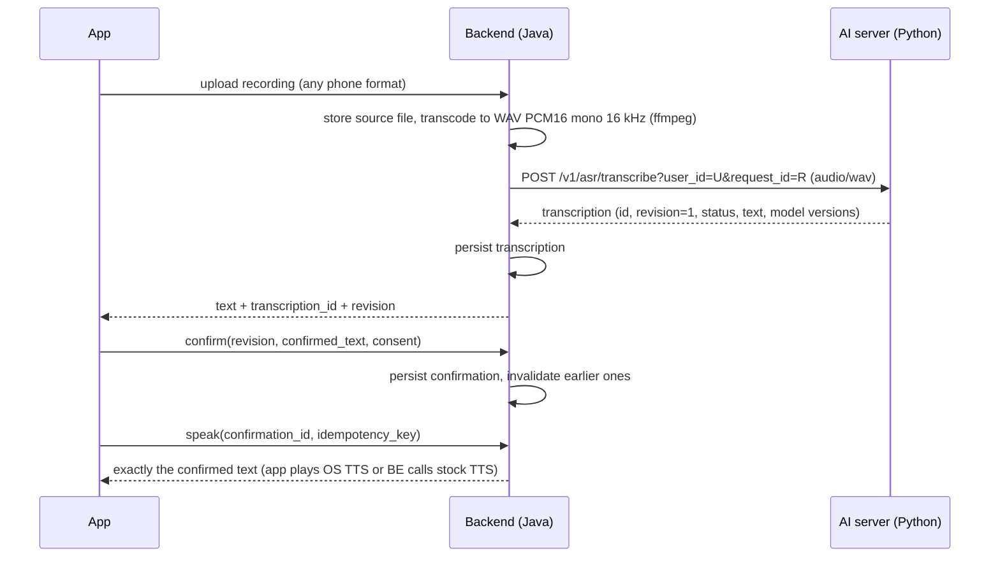

# AI Inference Server — Backend Integration Spec v1 (context file for Claude)

Contract `ai-contract-v1` · 2026-09-18 · AI owner: 제민 (jaemyu, AI/Data) · Team: 42VoiceBridge
Self-contained. Source of truth if this file and the AI repo disagree: `docs/AI_BACKEND_CONTRACT_v1_EN.md`
and `docs/openapi_ai_v1.yaml` in `github.com/42VoiceBridge/42VoiceBridge_AI`.

## 0. Instructions to Claude

- You are assisting a backend developer on a 5-person student team (GSIA SW Challenge; finals 2026-10-28).
  Planned backend stack: Java, hexagonal architecture [confirm with the user]. The AI part is a
  separate Python HTTP service; the backend calls it.
- Treat §3–§8 as a contract. **Do not invent fields, endpoints, defaults, or behaviour.** If the task
  needs something this file does not define, say so and have the user ask the AI owner.
- Implement every rule in §6 and write it as an automated test in the backend.
- Do not build anything listed in §10 (not in v1) unless the user says the AI owner approved it.
- Reply to the user in Korean. Code, identifiers and code comments in English.
- Numbers tagged [pilot] are experiment results on two speakers, not product performance. Never put
  them in UI copy, docs, or the proposal as a performance claim.

## 1. What the product does

Assistive speech-to-text for people with dysarthria (구음장애). The user speaks; the system shows the
recognized text; the user edits and confirms it; **only confirmed text** is spoken aloud by TTS.
A small personal model (LoRA adapter, ~14 MB) per user can improve recognition. For the 9/23
prototype, inference runs on a server, not on the phone.



## 2. Who owns what

| Concern | AI server | Backend | App |
|---|---|---|---|
| Auth, `user_id` | — | owns | sends token |
| Upload, transcoding to WAV 16 kHz mono | validates only | **owns** (ffmpeg) | records |
| Storage (audio, transcripts, confirmations, consents) | none (memory only) | **owns** | — |
| Recognition | **owns** | calls | — |
| Confirmation + TTS gate | reference implementation for the demo only | **owns in product** (same rules, §6) | enforces in UI |
| TTS audio | — | stock TTS, or app uses OS TTS | plays |
| Enrollment prompt selection | **owns** | stores what was shown | displays |
| Adapter training | **owns** code (offline in v1) | owns job queue + artifact storage [planned] | — |
| Jamo error statistics | **owns** computation | stores snapshots | displays with fixed wording |

## 3. Fixed decisions (do not relitigate in code)

| # | Decision |
|---|---|
| D1 | Server-side inference for the prototype. On-device is a later milestone |
| D2 | Base `openai/whisper-small` + per-user PEFT LoRA adapter, served by Transformers + PEFT |
| D3 | AI server input: **WAV PCM 16-bit, mono, 16 kHz, 0.3–30 s only** |
| D4 | `alternatives` is always `[]`, `score` and `score_type` always `null` in v1 |
| D5 | Only confirmed text may be spoken; any edit invalidates the confirmation; retries never duplicate speech |
| D6 | Adapter chosen server-side from `user_id`; clients can never name an adapter |
| D7 | "Weak phoneme diagnosis" is called **jamo-level model-error statistics** (`jamo-err-v1`); it describes the model, not the speaker |
| D8 | Consent to store audio and consent to use for training are separate flags, both default `false` |
| D9 | Greedy decoding (`beam_size=1`). Beam 5 produced repetition loops on short utterances |

## 4. Conventions

- JSON UTF-8, `snake_case`, UUID v4 ids, ISO-8601 timestamps with offset.
- `null` = not produced. Never coerce to 0 or "".
- Every AI result carries versions (`contract_version`, `model.*`, `audio.preprocessing_version`,
  `decoding.*`). **Persist them with the row.**
- Errors: HTTP status + `{"error": {"code": "...", "message": "...", ...detail}}`. Branch on `code`,
  never on `message`.

## 5. Endpoints (AI server)

Base URL: configurable (e.g. `AI_BASE_URL`). Hosting for team integration is not decided yet; develop
against the mock (§9).

### 5.1 `GET /v1/health`
Returns `status`, `contract_version`, `engine`, `base_model`, `base_revision`,
`preprocessing_version`, `beam_size`, `adapters[]` (`adapter_id`, `user_id`, `adapter_revision`,
`size_bytes`, `label`, `evidence`), `limits` (`min_sec` 0.3, `max_sec` 30, `sample_rate` 16000,
`channels` 1, `bits` 16). Call at startup; log it; fail fast if `contract_version != "ai-contract-v1"`.

### 5.2 `POST /v1/asr/transcribe`
Body: raw WAV bytes, `Content-Type: audio/wav`. Query: `user_id` (required), `use_adapter`
(default `true`; `false` forces base model), `request_id` (optional, echoed; send one and reuse it on retry).

Response 200:
```json
{
  "contract_version": "ai-contract-v1",
  "transcription_id": "4f1c…", "request_id": "r-123", "user_id": "u-42", "revision": 1,
  "status": "ok", "text": "물 좀 주세요",
  "alternatives": [], "score": null, "score_type": null,
  "model": {"engine": "transformers+peft", "base_model": "openai/whisper-small",
            "base_revision": "973afd24…", "adapter_id": "u-42_nall_s0", "adapter_revision": "a1b2c3d4e5f6"},
  "decoding": {"language": "ko", "task": "transcribe", "beam_size": 1},
  "audio": {"sha256": "…", "duration_sec": 2.41, "rms_dbfs": -31.2, "preprocessing_version": "pp-v1"},
  "latency_ms": 666, "created_at": "2026-09-18T16:00:00+0900"
}
```
- `status`: `ok` | `no_speech`. `no_speech` means `text == ""` (input below −60 dBFS, a heuristic,
  or empty decode). Not an error: tell the user nothing was heard.
- `model.adapter_id == null` means the base model ran (no adapter, or `use_adapter=false`).
- Measured latency [M]: median ~0.7 s server-side on a laptop CPU for 2–8 s utterances; ~0.85 s with an adapter.

### 5.3 `POST /v1/transcriptions/{transcription_id}/confirm` — reference only; backend owns this in product
Body `{"revision": 1, "confirmed_text": "...", "consent": {"store_audio": false, "use_for_training": false}}`.
Returns `confirmation_id`, `transcription_id`, `based_on_revision`, `confirmed_text`, `text_sha256`,
`source` (`asr_unedited` | `user_edited`), `edit_distance_syl`, `consent`, `supersedes`, `valid`, `confirmed_at`.
Errors: 404 `unknown_transcription`, 409 `stale_revision`, 422 `empty_text`.

### 5.4 `POST /v1/tts` — reference only; backend owns this in product
Body `{"confirmation_id": "...", "idempotency_key": "..."}` → `tts_id`, `confirmation_id`, `text`,
`text_sha256`, `engine` (`client_speech_synthesis`), `replayed`, `created_at`. The server does not
synthesize audio; it returns the only text the client may speak.
Errors: 404 `unknown_confirmation`, 409 `confirmation_superseded`, 409 `idempotency_key_reused`.

### 5.5 `POST /v1/analysis/jamo-errors`
Body `{"pairs": [{"ref": "<prompt or human-corrected text>", "hyp": "<model output>"}], "min_support": 20}`.
`ref` must be a known enrollment prompt or an independent human correction — **never the model's own
output**. Returns `metric_version` (`jamo-err-v1`), `min_support`, `pairs_used`, `reference_tokens`,
`insertions[]` (`token`, `position`, `count`), `tokens[]` (`token`, `position` initial|medial|final,
`errors`, `sample_count`, `error_rate` — `null` when `status == "insufficient_data"`, `status`,
`silent_initial`). UI wording must be "모델이 자주 놓치는 부분" (what the model often misses), **never**
"your weak pronunciation".

### 5.6 `POST /v1/enroll/next-prompts`
Body `{"user_id": "...", "n": 10, "strategy": "random", "seed": 0, "exclude_prompt_ids": []}` →
`strategy`, `strategy_version` (`prompt-random-v1`), `seed`, `pool_size` (1807), `prompts[]`
(`prompt_id`, `text`). Only `random` exists; `coverage` / `error_based` return 501. Persist
strategy + version + seed with every prompt shown.

### 5.7 `POST /v1/adapters/train` — returns 501 in v1 (see §10)

## 6. Rules the backend must enforce (write each as a test)

1. Never send anything but WAV PCM16 mono 16 kHz, 0.3–30 s to the AI server; split or reject longer audio.
2. A user never gets another user's adapter. The backend passes only the authenticated `user_id`;
   never accept an adapter id from the client.
3. Speech output only for the **latest valid confirmation** of a transcription. Any edit creates a
   new confirmation and invalidates the previous one.
4. `idempotency_key` → at most one TTS event; retrying the same key returns the same event; reusing a
   key for a different confirmation is a 409.
5. Confirmation must reference the current `revision`; stale revision → 409.
6. Consent flags default `false`. Only recordings with `use_for_training=true` may ever be exported
   for training. Deleting such recordings requires retiring adapters trained on them.
7. Never display `score` or `alternatives` in v1; never display "safe", "correct", "정확합니다".
8. Store the AI response's version fields with every transcription row.
9. `no_speech` is a normal outcome, not an error.

## 7. Suggested persistence (backend DB)

| Table | Columns (type) |
|---|---|
| `recording` | `recording_id` uuid PK, `user_id`, `purpose` enum(enroll,use), `prompt_id` null, `source_codec`, `source_sample_rate` int, `source_channels` int, `sha256_source`, `sha256_wav16k`, `duration_sec` real, `storage_uri`, `consent_store_audio` bool=false, `consent_train` bool=false, `created_at` |
| `transcription` | `transcription_id` uuid PK (from AI), `recording_id` FK, `user_id`, `request_id`, `revision` int, `status`, `text`, `alternatives_json`, `score` null, `score_type` null, `engine`, `base_model`, `base_revision`, `adapter_id` null, `adapter_revision` null, `beam_size` int, `preprocessing_version`, `audio_sha256`, `latency_ms` int, `created_at` |
| `confirmation` | `confirmation_id` uuid PK, `transcription_id` FK, `based_on_revision`, `confirmed_text`, `text_sha256`, `source`, `edit_distance_syl` int, `consent_store_audio`, `consent_train`, `supersedes` null FK, `valid` bool, `confirmed_at` |
| `tts_event` | `tts_id` uuid PK, `confirmation_id` FK, `idempotency_key` UNIQUE, `text_sha256`, `engine`, `created_at` |
| `prompt_shown` | `user_id`, `prompt_id`, `text`, `strategy`, `strategy_version`, `seed`, `shown_at` |
| `adapter` [planned] | `adapter_id` PK, `user_id`, `status` enum(queued,running,failed,validated,active,retired), `base_model`, `base_revision`, `adapter_revision`, `size_bytes`, `artifact_uri`, `dev_metric_json`, `baseline_dev_metric_json`, `config_json`, `created_at`, `activated_at`; at most one `active` per user |
| `jamo_error_snapshot` | `user_id`, `adapter_id` null, `metric_version`, `min_support`, `pairs_used`, `computed_at`, `rows_json` |

Hexagonal hint: an outbound port (e.g. `SpeechRecognitionPort`, `JamoStatsPort`, `PromptPort`) with one
HTTP adapter to the AI server and one fake adapter for tests. The confirmation/TTS gate is domain
logic in the backend, not an AI call.

## 8. Audio ingest (backend)

- Accept the phone's format, keep the original, transcode with a real decoder:
  `ffmpeg -i in.m4a -ac 1 -ar 16000 -sample_fmt s16 out.wav`
- Check channel count before downmixing (averaging stereo can cancel or mix another voice).
- Validate: finite samples, duration 0.3–30 s after transcoding; cap upload size (AI server rejects bodies > 5 MB).
- Never trust sample rates declared in metadata; read the file header. (In the AI-Hub dataset the
  declared rate was wrong for 97 of 119 files.)

## 9. Local development without models

The AI repo (`demo/`) contains the reference server and the conformance tests. Needs Python 3 + numpy only:
```bash
ASR_ENGINE=mock python3 demo/server.py              # http://127.0.0.1:8000, fake text, real contract
python3 demo/test_contract.py http://127.0.0.1:8000  # expect "0 failed"
```
The mock enforces the same validation, errors, confirmation and TTS rules as the real engine. Point the
backend's HTTP adapter at it and run your own integration tests against it.

## 10. Not in v1 (do not build yet)

- Candidates / confidence display; streaming recognition; on-device inference; server-side TTS audio.
- `coverage` and `error_based` prompt strategies.
- Adapter training API. Planned job contract: `POST /v1/adapters/train` with `user_id`,
  `train_items[]` (`recording_id`, `text`, `split`), `config`; statuses
  `queued → running → failed | validated → active → retired`; an adapter becomes `active` only if it
  beats the base model on the user's dev items; keep the previous one for rollback. In v1 the AI owner
  trains offline (Colab) and installs adapters manually.
- Multi-worker AI serving (v1 serializes inference; one PEFT model holds one active adapter at a time).

## 11. Open questions (resolve with the AI owner before building)

1. Where the AI server runs for team integration and the 9/23 demo (currently the AI owner's Mac).
2. Whether the app talks to the AI server directly for the 9/23 demo or always through the backend
   (recommended: through the backend; the AI server has no auth).
3. Training-data export format from the backend (needs `recording_id`, WAV path, confirmed text,
   `user_id`, duration; split is assigned by the AI side).
4. TTS engine choice (OS TTS in the app vs a stock TTS API).
